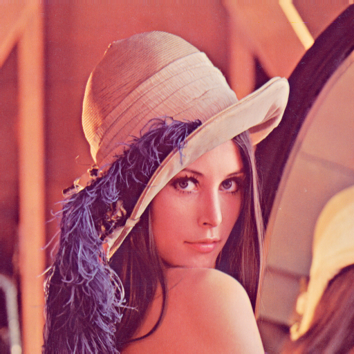
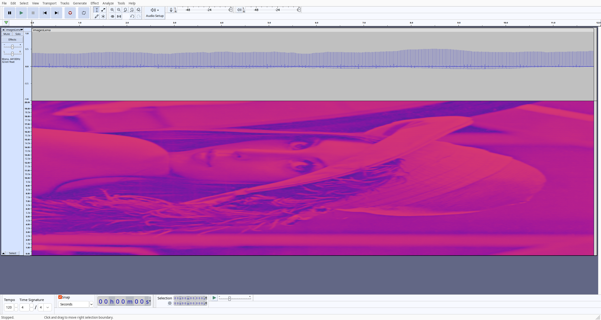

# Pic2Spec

Picture                    | Audio Spectrogram
:-------------------------:|:-------------------------:
  |  

Convert a picture's intensity into a Fourier transform every x miliseconds,
iFFT and save to wav.

First convert picture to greyscale.
Each row of pixels needs to turn into an intensity plot of the same resolution.
(How would I expand this to other (higher) resolutions?). In FFT, just
interpolate, for pictures... ML upscale? [TODO]

Convert each row of size `WIDTH` into a time series of N samples where
N = 2 ** (np.log2(WIDTH) + 1)
(i.e. a 1920 px row would turn into a 2 ** 12 (=4096) sample sound.)
Why? Better for FFTs.

Map intensity of pixel to an amplitude.
Repeat for `HEIGHT` rows.

## Audibility:

  We're free to play with the sample rate we save the wav file at.
  Typically, 1920x1080 => 4096 * 1080 = 4_423_680 samples

  At 44.1kHz, that's ~100.3 seconds. Too long. Let's do 441kHz. Wait what?
  OK unreasonable. Let's limit ourselves to audible sound.
  This means limiting the samp rate to 44.1KHz
  (our max freq would be 22.05kHz, audible.)

TODOs:
  - Do again but in C; code golf.
